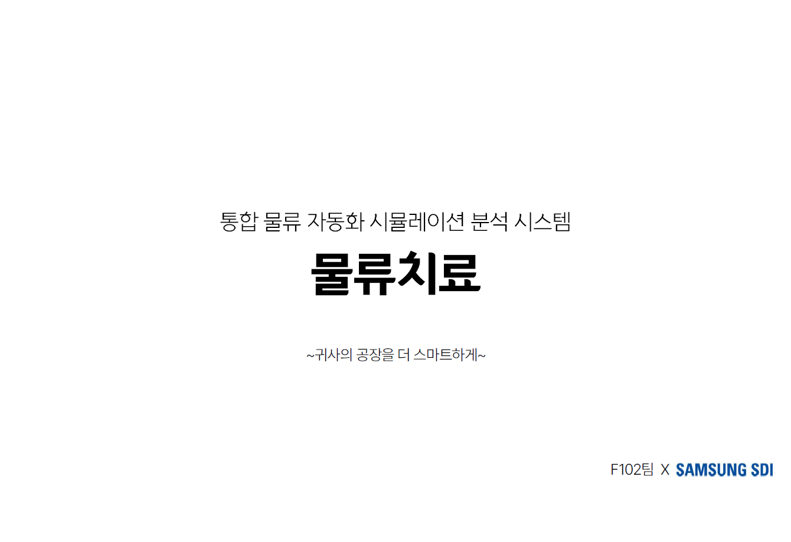

`물류치료는 삼성 SDI 물류 자동화를 위해 AGV(자율주행 무인자동차)의 최적동선을 알고리즘으로 찾아내고 ACS(AGV Control System) 시뮬레이션을 통해 시연하는 프로젝트입니다. `


삼성청년소프트웨어아카데미 5기 자율프로젝트 기업연계트랙으로 진행된 프로젝트로 삼성SDI와 연계하여 물류 자동화 과정에서 기존에 AGV들의 동선을 수작업으로 작성하여 발생했던 휴먼 에러 및 보틀넥을 줄이고, 효율 최대화를 위하여 AGV들의 동선을 최적화하는 알고리즘을 도출하여 시뮬레이션으로 시연하는 것을 목표로 합니다.

## 기여자

### 5기 자율프로젝트

<table>
  <tr>
    <td align="center"><a href="https://github.com/paran-yu"><br /><sub><b>강리정</b></sub></a><br />Simulator</td>
    <td align="center"><a href="https://github.com/seungcheol-py"><br /><sub><b>오승철</b></sub></a><br />Core</td>
    <td align="center"><a href="https://github.com/tyl1996"><br /><sub><b>이태용</b></sub></a><br />Simulator</td>
    <td align="center"><a href="https://github.com/MMyungji"><br /><sub><b>정명지</b></sub></a><br />Core</td>
    <td align="center"><a href="https://github.com/dongyooncho"><br /><sub><b>조동윤</b></sub></a><br />UI</td>
  </tr>
</table>

### 6기 실습코치

<table>
  <tr>
    <td align="center"><a href="https://github.com/tyl1996"><br /><sub><b>이태용</b></sub></a><br />오픈소스(물류치료) 관리</td>
    <td align="center"><a href="https://github.com/parkjisu6239"><br /><sub><b>박지수</b></sub></a><br />오픈소스(물류치료) 관리</td>
    <td align="center"><a href="https://github.com/emost22"><br /><sub><b>강용수</b></sub></a><br />오픈소스(물류치료) 관리</td>
  </tr>
</table>

### 그리고 당신...!

<table>
  <tr>
    <td align="center"><a href=""><br /><sub><b>${당신}</b></sub></a><br />${6기 교육생}</td>
  </tr>
</table>

## 주요 기능

- 사용자 환경에 맞춤형 설정
- 검증된 알고리즘으로 동선 배정
- 시뮬레이션을 통한 사전 검증
- 시뮬레이션 결과 분석


## 세부 기능

| 구분 | 기능                         | 설명                                                         |
| ---- | ---------------------------- | ------------------------------------------------------------ |
| 1    | **레이아웃 생성**            | 도면 이미지를 불러오기하여 위에 도로, 포트, 충전기(대기장소) 등 아이템과 맵을 자유자재로 그릴 수 있습니다. |
| 2    | **파라미터 상세 설정**       | 현실 세계의 수치들을 입력하여 AGV, Port 등의 변수값을 입력할 수 있습니다. |
| 3    | **최적동선을 위한 알고리즘** | A*, MAPF 등 길찾기 알고리즘 기반의 자체제작 알고리즘으로 다수의 차량을 종합적으로 고려한 동선을 제공합니다. |
| 4    | **물리법칙 적용 시뮬레이션** | 1초 단위 동작까지 AGV의 실제 물리적 움직임을 모사한 시뮬레이션을 제공하고, 2D 모델링으로 보여줍니다. |
| 5    | **분석 데이터 출력**         | 시뮬레이션 데이터를 DB에 저장하고, 효과적인 분석을 위한 통계를 제공하며, Excel 파일로 내보내기를 지원합니다. |

- UI에 대한 자세한 내용은 [**여기**](UI/README.md)에서 확인할 수 있습니다.
- 사용된 경로 탐색 알고리즘에 대해서는 [**여기**](Core/README.md)에서 확인할 수 있습니다.


## 아키텍처

> 해당 프로젝트의 구조에 대한 이해를 높이기 위해 자료를 첨부했습니다.

<details>
<summary>프로젝트 소개</summary>
  
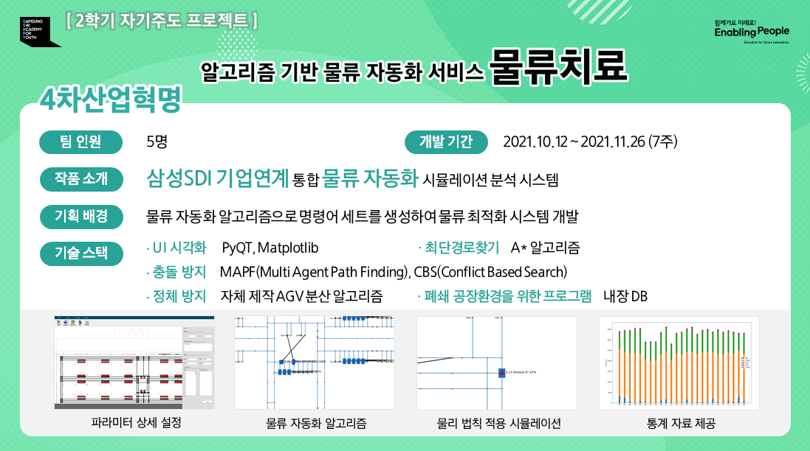

</details>

<details>
<summary>기술스택</summary>

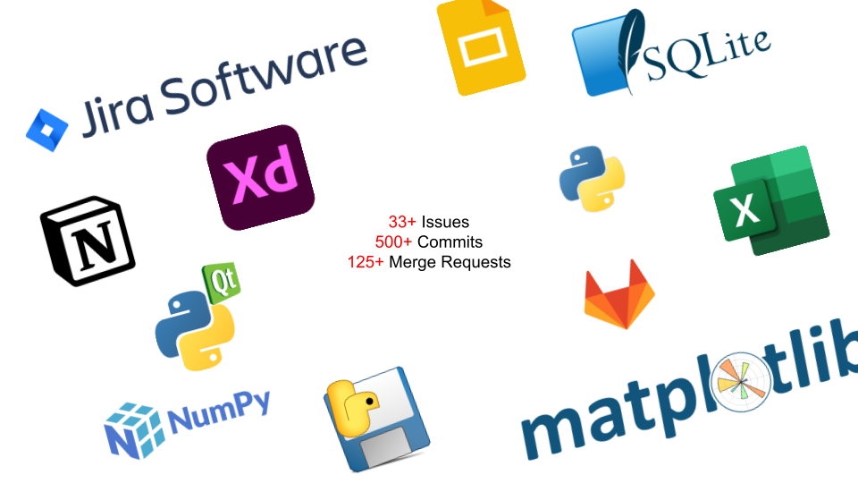

> 파워포인트를 활용해 작성했습니다

</details>

<details>
<summary>아키텍쳐 구성도</summary>
  
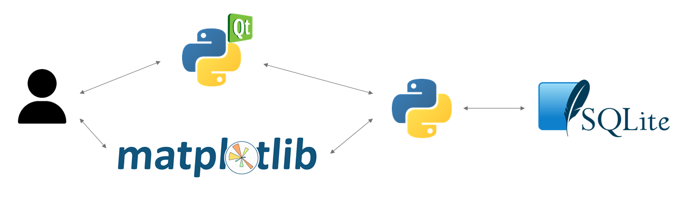

> [파워포인트를 활용](docs/architecture.pptx)해 작성했습니다

웹 어플리케이션이 아니므로 보통의 아키텍쳐 구성도와 달리 로컬 환경에서 동작합니다.

</details>

<details>
<summary>프로젝트 구조도</summary>
  
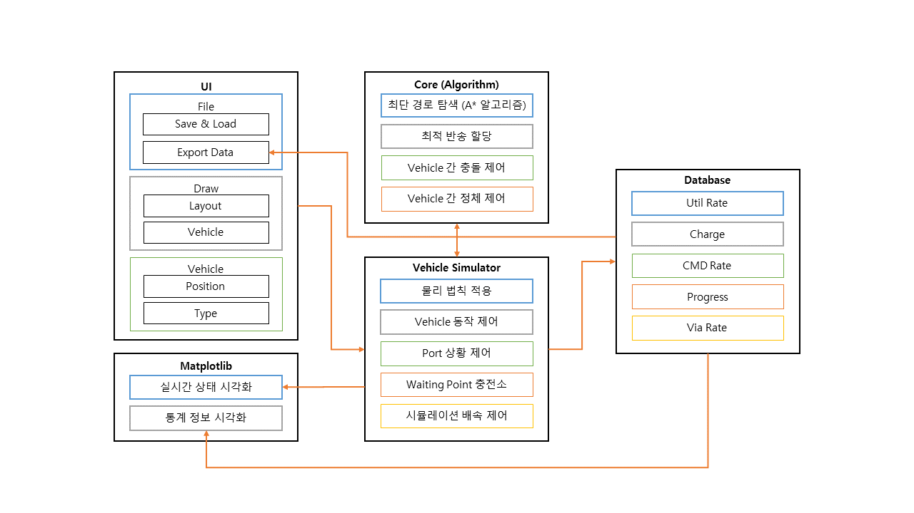

> [파워포인트를 활용](docs/project-structure.pptx)해 작성했습니다

</details>

<details>
<summary>디렉토리(폴더) 구조도</summary>

익숙한 Spring, Django 등 프레임워크가 아니므로 폴더 구조를 이해하기 어려울 수 있습니다. 아래와 같이 주석을 첨부하였으니, 위 프로젝트 구조도와 함께 살펴보시길 바랍니다.

```
{rootdir}
│  .gitignore
│  data.xml                 # 지도와 차량 정보(필수)
│  db.py                    # db에 저장하는 메서드 로직
│  example.png
│  example.xml
│  main.py                  # 프로그램 실행
│  map.layout               # 설계도면 정보, pickle 모듈 사용, 불러오기
│  mapreader.py             # data.xml 불러오기, 객체 생성 로직
│  README.md
│  requirements.txt
│  sample.xlsx              # Excel로 추출 결과물
│  simul_data.db            # sqlite db (실행시 생성)
│  statistics.py            # 통계기능 로직
│  
├─Core                    # 인지, 판단 및 명령 생성 로직
│  │  a_star.py             # 경로 탐색 알고리즘
│  │  back_agv.py           # 복귀 명령
│  │  call_agv.py           # 호출 명령
│  │  check_collision.py    # 충돌제어
│  │  README.md
│  │  send_agv.py           # 반송 명령
│  │  
│  └─README.assets
│          
├─docs
│      
│      
├─exec                    # 포팅 산출물
│      README.md
│      simul_data.db
│      
├─res                     # 객체 선언부
│  │  node.py               # 노드 및 상속 클래스(포트 등) 선언
│  │  vehicle.py            # AGV 선언
│  │  
│  └─img
│         example.png
│         map.jpg           # 공장도면(필수)
│          
├─simulator               # 시뮬레이터, Matplotlib 로직
│     simulator.py
│     __init__.py
│          
└─UI                      # UI(PyQT5)
    │  .gitignore
    │  classes.py
    │  mainPage.py
    │  operationData.py
    │  README.md
    │  scale.py
    │  sceneSelector.py
    │  selector.py
    │  sidebar.py
    │  vehicleEditor.py
    │  
    └─resources
        └─image

```

</details>

<details>
<summary>시퀀스 다이어그램</summary>

수정하거나 학습하고 싶은 코드가 어디에 있는지 전반적인 이해를 위해서 시퀀스 다이어그램을 참고할 수 있습니다.

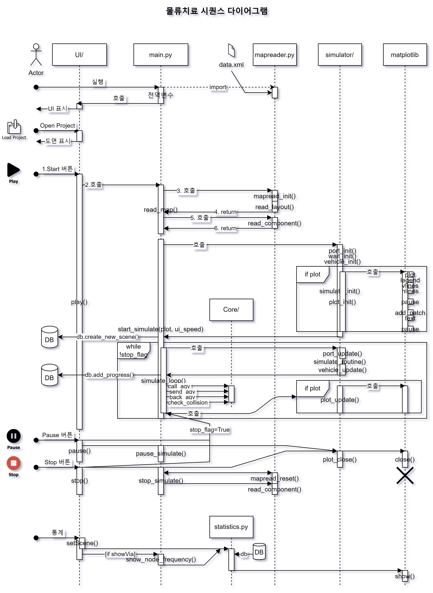

> - draw.io 를 활용해 작성했으며, 해당 파일은 [docs/sequenceDiagram.drawio](docs/sequenceDiagram.drawio) 에서 확인 가능합니다.
> - [UML 시퀀스 다이어그램 표준](https://www.omg.org/spec/UML/)과 다를 수 있으며, 가독성 및 이해를 위해 일부 생략된 부분이 있을 수 있습니다.

Core, UI의 내용은 방대하고 모듈화가 잘 되어있어 간소화되었습니다. 자세한 내용은 README([UI](UI/README.md), [Core](Core/README.md))를 참고바랍니다.

가장 메인이 되는 Play(Start) 버튼에 대해 설명드리겠습니다. main.py를 실행하고, Open Project로 layout 파일을 열었다고 가정하겠습니다.
1. UI에서 Play 버튼을 클릭하면, main.py에서 사용자가 입력한 layout파일을 읽어오기 위해서 mapreader.py 의 함수들을 호출합니다.
2. mapreader.py 에서는 data.xml의 데이터를 바탕으로 Vehicle, Node 등의 객체 인스턴스를 생성하고 main.py에 전달합니다.
3. main.py에서는 시뮬레이터으로 데이터를 옮기고 초기화합니다. `plot==True`라면 matplotlib 시각화를 위해 환경을 구성합니다. matplotlib의 코드는 simulator.py에 구현되어있으나, 인스턴스가 어떻게 추가되는지를 위해 별도의 lifeline(matplotlib)을 그렸습니다.
4. 시각화 초기 환경 구성이 끝나면 실행의 단위인 scene을 생성하여 DB에 저장합니다.
5. simulate_loop() 반복은 멀티쓰레딩을 활용했으며, 이는 matplotlib 시각화가 메인 쓰레드에서 작동해야하는 한계로 인해 그렇습니다. (다이어그램에서는 미표기)
6. 시뮬레이터에서 1초가 지난 이후의 상태를 업데이트하고, DB에 저장합니다.
7. Core에서 시뮬레이터 상의 데이터를 읽고 판단하여 AGV를 호출, 반송, 복귀, 충돌제어 등의 명령을 하달합니다.
8. `plot==True`라면 matplotlib 시각화를 업데이트합니다.
9. `stop_flag==True` 가 될 때까지 반복문이 실행되며, 이는 Pause 혹은 Stop 버튼을 클릭하여 조절할 수 있습니다.


</details>


## 설치 및 실행

소스 코드를 다운로드하여 직접 프로그램을 실행할 수 있습니다. 

직접 코드를 실행하는 경우 3.7 버젼 이상의 [파이썬3](https://www.python.org/downloads/)이 필요하며, 아래 절차에 따라 실행하면 됩니다. 개발환경은 3.9 버젼입니다.

##### 파일 다운로드

```
git clone https://lab.ssafy.com/s05-final/S05P31F006.git
```

그 외, 상단 다운로드 버튼을 클릭하여 zip 파일로 다운로드, 압축해제하면 됩니다.

##### 모듈 설치

프로젝트 폴더로 이동하여 의존성 프로그램을 설치합니다.

```
pip install -r requirements.txt
```

##### 실행

```
python main.py
```

## 사용예시

##### 메인화면

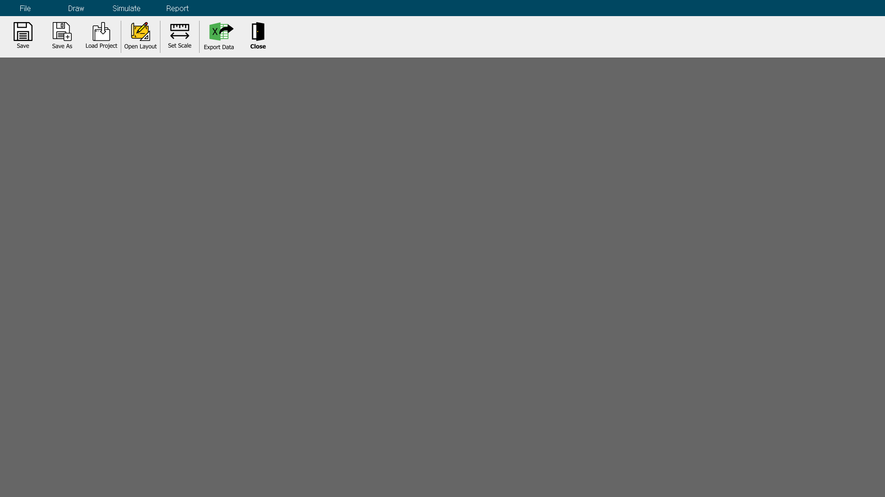

##### 레이아웃 그리기

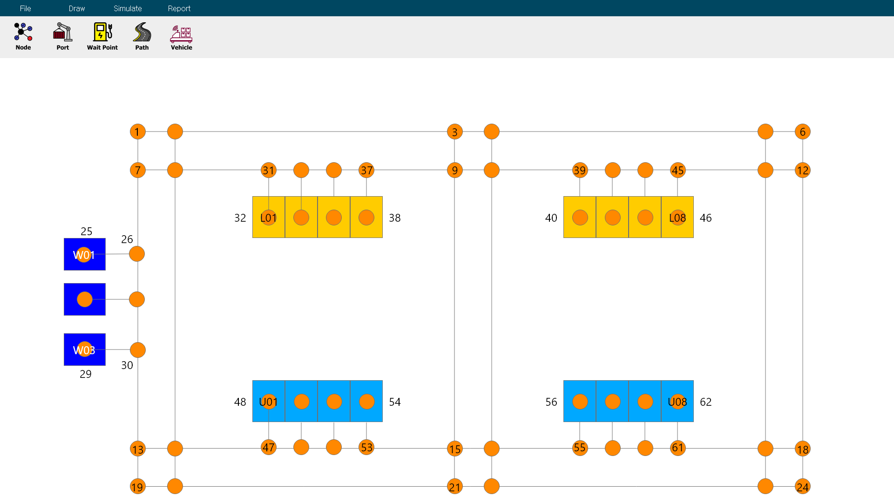

##### 데이터 입력

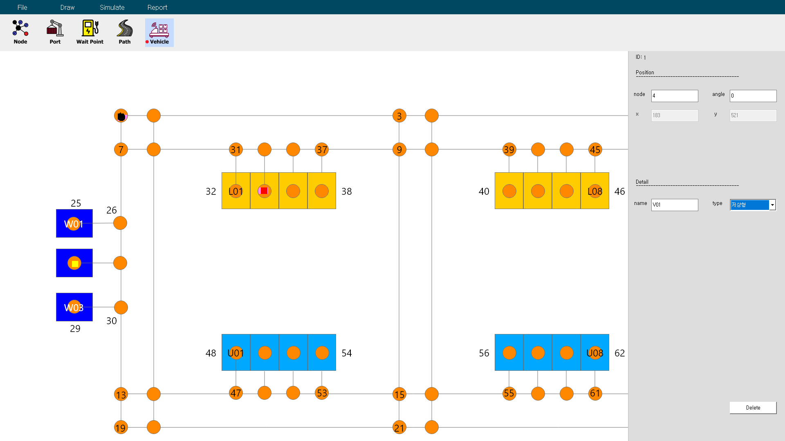

##### 시뮬레이션 실행 + 2D 모델링

> 위 사용예시의 레이아웃과는 다른 레이아웃을 사용하여 시뮬레이팅했습니다.

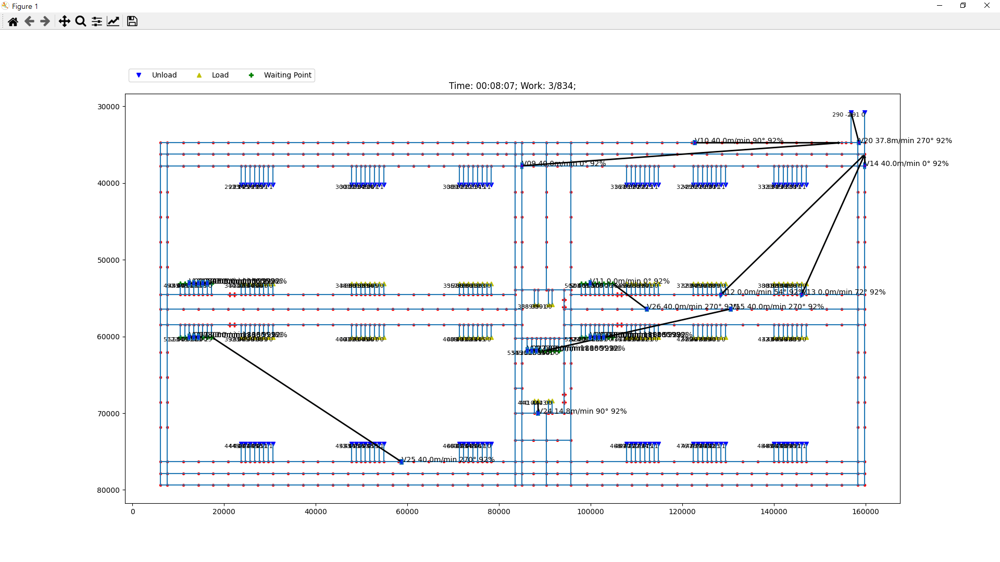

##### 데이터 출력

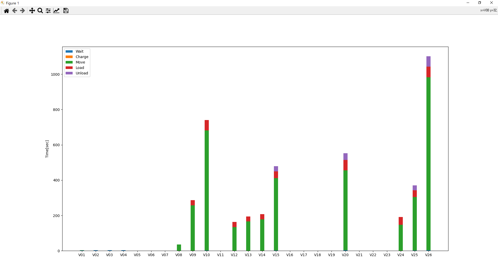


## 개발설정

- Python 3.9.7
- 가상환경을 지원하지 않습니다.
- 경로명에 한글이 들어간 경우 정상적으로 작동하지 않을 수 있습니다.
- 하드웨어 사양에 따라 디스플레이 내용이 달라질 수 있습니다.


## 릴리즈 히스토리

- 1.0.0: 5기 자율프로젝트 제출

## 추가정보

프로젝트 기간: 2021-10-11 ~ 2021-11-19 (6주)

## 기여

### 학습

먼저 프로그램을 실행해보고, README([UI](UI/README.md), [Core](Core/README.md))를 읽으며 학습합니다.
이후 관심 있는 부분에 대한 코드를 찾아 학습합니다.
개발 중 논의 및 합의사항은 Wiki 대신 [Issue]()에 있습니다. 개발 당시의 내용으로 현재와 다를 수 있습니다.

### 질문

질문은 다양한 방식으로 가능합니다. 어려워마시고 질문해주세요.
- Issue를 작성하여 Question 라벨을 붙이기
- 기존 Issue, MR 등에 댓글 달기
- Mattermost로 DM 등

### Issue

질문 외에도 버그를 발견하거나, 추가하면 좋을 것 같은 기능 등이 있으면 Issue를 남겨주세요.

1. 새로운 Issue를 작성하세요 (https://lab.ssafy.com/s05-final/S05P31F006/-/issues/new)

> 버그, 기능개선 등 Issue Template(템플릿)은 참고사항이며, 자유롭게 작성하셔도 됩니다.

### Merge Request

코드를 수정하고 싶은 경우 아래의 방법에 따라 MR을 보내주세요.

1. 해당 프로젝트를 Fork 하세요 (https://lab.ssafy.com/s05-final/S05P31F006/-/forks/new)
2. feature 브랜치를 생성하세요 (`git checkout -b feature/fooBar`)
3. 변경사항을 commit 하세요 (`git commit -m 'feat: Add some fooBar'`)
4. 브랜치에 Push 하세요 (`git push origin feature/fooBar`)
5. 새로운 Merge Request를 요청하세요
> - Template(템플릿)은 참고사항이며, 자유롭게 작성하셔도 됩니다.
> - 미리 description을 작성하고 싶으시다면, Draft로 생성해놓으셔도 됩니다.

## 라이선스

Distributed under the SGPL license. See [License](LICENSE) for more information.

## 관련문서

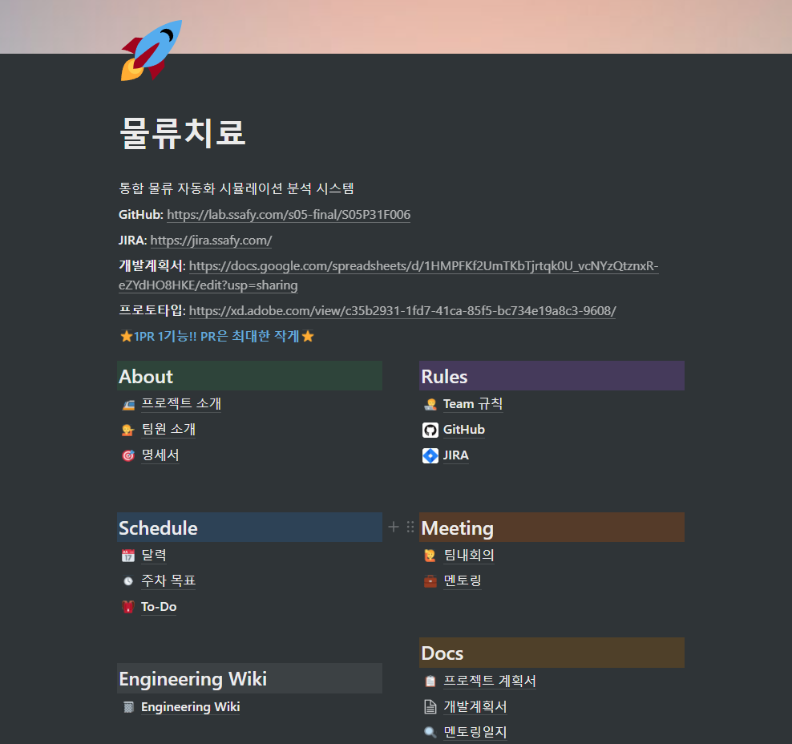

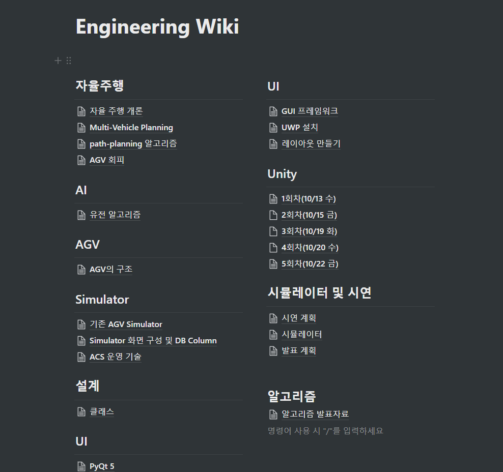

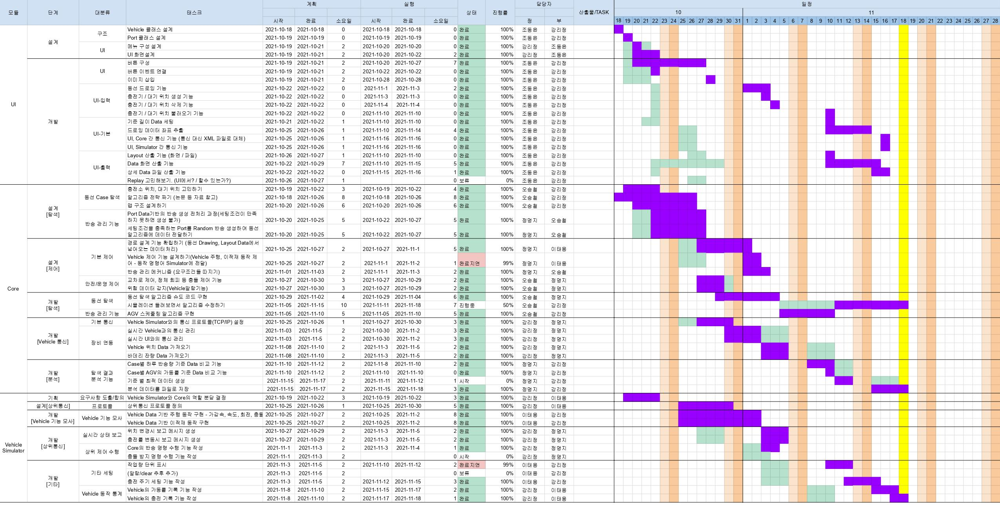

